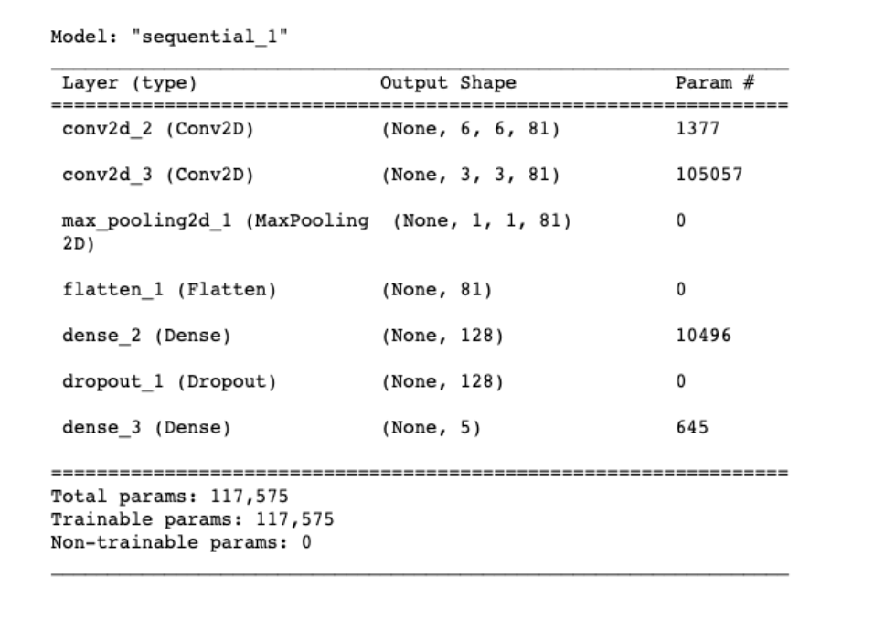
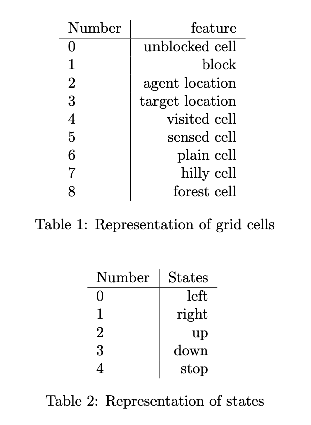
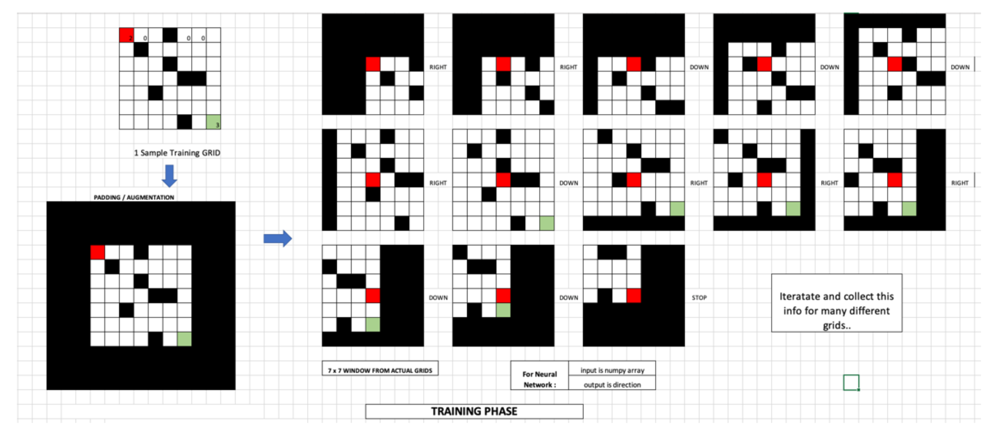
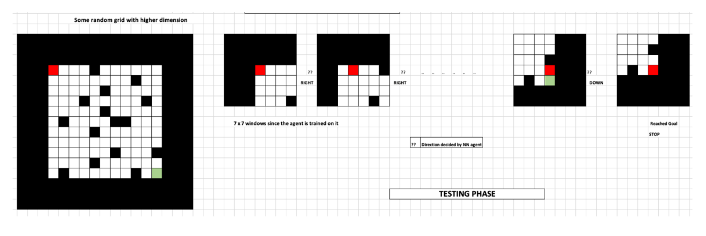
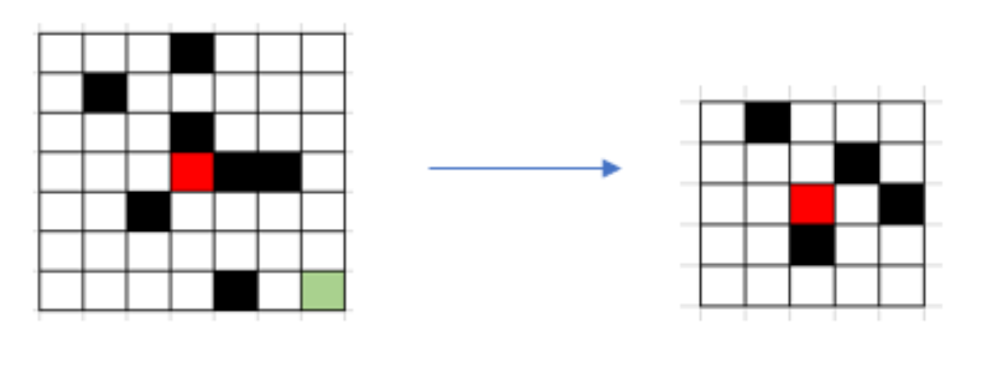
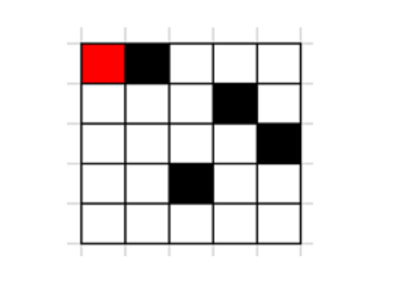
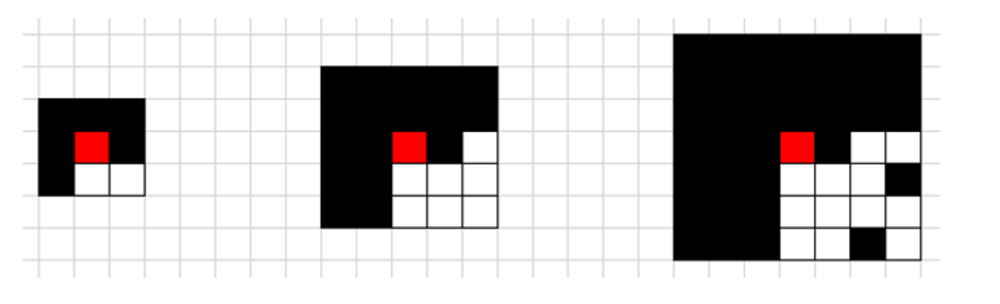
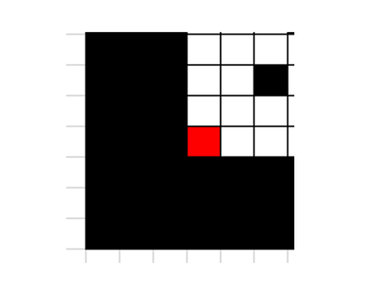

# pathfinder-cnn
Image Classification based path finder

# ARCHITECTURE

The first input layer specifies the shape of the data, in this case 9x9x1, since we are using a window of size 9.
The first layer after that is now a convolutional layer, 2D, meaning a window is passed over the entire window. We need to specify the window size (kernel size) in this case to be 4 by 4 . We need to specify the stride, or how far the window needs to be moved over when computing the next feature - in this case, 1 in the x direction and 1 in the y direction.

We also need to specify the number of features or filters computed for each window, in this case 64. Each filter has a set of weights and biases defining what it computes for the data in its 3x3 window, and the same 64 feature weights are used each time the window is applied.
The initial 9x9x1 input data is transformed by the convolutional layer into a block of 5x5x81 values, 81 features computed for each possible 4x4 square.
That large block is then flattened into a single vector of length 5x5x81, which is then passed into a series of dense layers, ending with a 5-dimensional softmax layer, computing 5 exclusive class probabilities representing the directions from - left, right, up, down and stop.

# Implementation
In order to train our agents, we are considering a grid size of 50x50 with a blocking density of 0.3. We are using a concept of windowing where instead of using the whole grid as training data, we are splitting the data in chunks, where each chunk represents a subset of the original grid. This subset of the grid, we call as a window. Windowing, however can be painful, since in each grid, there will be many portions of the grid to collect we need to make sure that the agent is inside that window. To simplify this, we made sure that the agent’s position is at the center of each window, keeping consistency in collecting the window data while the agent is moving. With our experiments(shown in the Section Training Improvements as part of extra credit), it is observed that Window size 9x9 performs better. So we will be added a padding of 4 rows and columns at the edge of the wall which can be calculated by (window size - 1)/2. The training is done on 50,000 grids with 0.3 density and to test our agent, we are using a 50x50 grid and a blocking density same as training i.e, 0.3 with 3000 overall grids.
We have included following features in the grid to better train the neural network. Grid world cells representation in terms of number is shown in table 1. Classes used in the training are shown in table 2.

Initially the agent has no clue about the grid and considers all cells as unblocked. Since we are using window of the original Grid as training, we pass 7x7 window from the grid, keeping agent at the center of the grid to the neural network, which classifies the direction. After each move, we update the grid - agent location as 2 and any neighboring grids containing a block as 1 and mark the visited cells as 4. This continues, until we receive a stop signal from the network.

# Training Improvements
In this section, we talk about some of the parameters like how we decided on grid dimension to train the agents and the corresponding window size,how to efficiently train the agent and testing on the different blocking densities.
## Size of the grid and windowing
Initially we chose full grid size for the training phase. However,this works well for small grids, since the number of combinations of different grids would be equal to picking 1/3 of all the cells in the grid as blocked ( considering 0.3 density) which would be nCr where
                                                       n = (dim x dim) − 2
We are doing “-2” since target and agent starting positions will always be open.
                                                     r = ( (dim x dim) − 2 )/ 3
So if the grid size is 50 X 50, that would give us something around 2948C832 which would take forever to generate.
Our idea: Consider batches of grid, a window of some smaller size from the original training grids where the agent is at the center of that window. This would reduce the number of combinations we require to train the agent, and would be faster to implement. Example : A 5x5 window from original grid of higher Dimension say, 7x7 as shown

But this performs different when the agent is in the corner of the grid while training.

General solution would be to add some kind of augmentation to smartly position the agent at the centre of the grid, in this case, since the agent cannot move beyond the walls of the original grid, we can add blocked cells as padding rows and columns.
NOTE: we must choose the padding size based on the window size. So if the window size is 3, the minimum padding should be of 1 row and column, 2 padding for 5 window size and so on.

## Padding Illustration

Padding size depends on the window size we choose. This is to make sure the agent is always at the middle of the window grid and it is easy for the neural network to understand. So, padding size will be 1 for 3x3, 2 for 5x5 and 3 for 7x7 window size respectively.

Choosing the right window size depends upon the size of the original grid to test. In our case, we started testing with 3x3 as a window size and we encountered situations where the agent would fall into the infinite loop quite often. So we increased the window size to train. Since for the neural network, each cell acts as a feature increasing the window size would help the agent not to get stuck more often. Overall, there is a trade-off between including more features for the training and the time to train.

## Unexplored Cells

One minor yet important thing to consider while training the agent would be to include pathways where the normal blindfolded agent would rarely go. For example, Our blindfolded agent knows that target is at bottom right corner of the grid, so we prioritize the moves – right and bottom than the moves,left and up, so the region near diagonal of the grid is more explored by our original agent. But what if the neural network decisions moves the agent to somewhere at bottom left? Figure 30 shows the example.

This is rarely reached location by the blindfolded agent, so the model would predict a direction based on a training grid with similar features, and that can be wrong as well since there would be no instance of training with such positions. So to tackle this issue, while creating random grids, we can start the agent at random locations, keeping the x fixed and y random, or maybe random start positions in the grid for better coverage.
